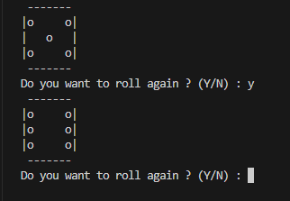

# Read Me 
This Python script simulates the rolling of a 6-sided dice using ASCII art to represent the dice faces.
## Usage
run " python Roll_D6.py " in terminal
## Example

## Author
Furkan Sarsilmaz